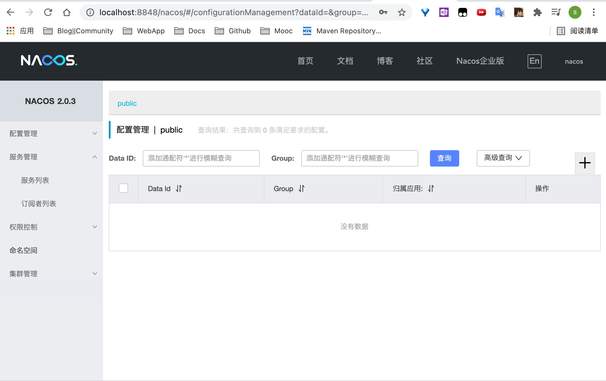
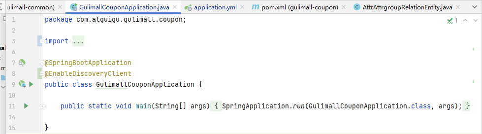
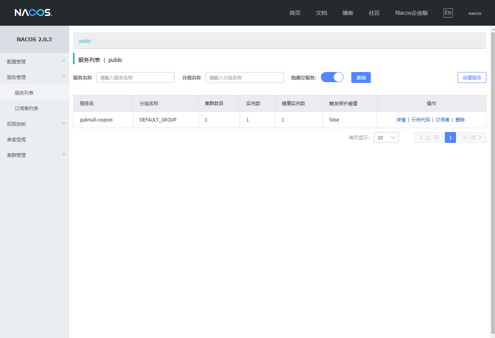

<!-- START doctoc generated TOC please keep comment here to allow auto update -->
<!-- DON'T EDIT THIS SECTION, INSTEAD RE-RUN doctoc TO UPDATE -->
**Table of Contents**  *generated with [DocToc](https://github.com/thlorenz/doctoc)*

- [分布式组件](#%E5%88%86%E5%B8%83%E5%BC%8F%E7%BB%84%E4%BB%B6)
  - [SpringCloud Alibaba](#springcloud-alibaba)
    - [配置中心](#%E9%85%8D%E7%BD%AE%E4%B8%AD%E5%BF%83)
    - [网关](#%E7%BD%91%E5%85%B3)
    - [SpringCloud 的几大痛点](#springcloud-%E7%9A%84%E5%87%A0%E5%A4%A7%E7%97%9B%E7%82%B9)
    - [SpringCloud Alibaba 的优势](#springcloud-alibaba-%E7%9A%84%E4%BC%98%E5%8A%BF)
    - [依赖关系](#%E4%BE%9D%E8%B5%96%E5%85%B3%E7%B3%BB)
  - [nacos-server](#nacos-server)
    - [下载nacos-server](#%E4%B8%8B%E8%BD%BDnacos-server)
    - [启动nacos-server](#%E5%90%AF%E5%8A%A8nacos-server)
    - [将微服务注册到nacos中](#%E5%B0%86%E5%BE%AE%E6%9C%8D%E5%8A%A1%E6%B3%A8%E5%86%8C%E5%88%B0nacos%E4%B8%AD)

<!-- END doctoc generated TOC please keep comment here to allow auto update -->

# 分布式组件

## SpringCloud Alibaba

Spring Cloud Alibaba 致力于提供微服务开发的一站式解决方案。此项目包含开发分布式应用 微服务的必需组件，方便开发者通过 Spring Cloud 编程模型轻松使用这些组件来开发分布式应用服务。

依托 Spring Cloud Alibaba，您只需要添加一些注解和少量配置，就可以将 Spring Cloud 应用 接入阿里微服务解决方案，通过阿里中间件来迅速搭建分布式应用系统。

https://github.com/alibaba/spring-cloud-alibab

注册中心

选择调用哪一台机器的服务

### 配置中心

集中管理配置，修改某个服务的配置，其他同类型服务的配置也同步改动

### 网关

前端的请求先通过统一的鉴权，过滤，路由

### SpringCloud 的几大痛点

SpringCloud 部分组件停止维护和更新，给开发带来不便;

SpringCloud 部分环境搭建复杂，没有完善的可视化界面，我们需要大量的二次开发和定制 SpringCloud 配置复杂，难以上手，部分配置差别难以区分和合理应用

### SpringCloud Alibaba 的优势

阿里使用过的组件经历了考验，性能强悍，设计合理，现在开源出来大家用 成套的产品搭配完善的可视化界面给开发运维带来极大的便利，搭建简单，学习曲线低

```
结合 SpringCloud Alibaba 我们最终的技术搭配方案：
SpringCloud Alibaba - Nacos：注册中心（服务发现/注册）
SpringCloud Alibaba - Nacos：配置中心（动态配置管理）
SpringCloud - Ribbon：负载均衡
SpringCloud - Feign：声明式 HTTP 客户端（调用远程服务）
SpringCloud Alibaba - Sentinel：服务容错（限流、降级、熔断）
SpringCloud - Gateway：API 网关（webflux 编程模式）
SpringCloud - Sleuth：调用链监控
SpringCloud Alibaba - Seata：原 Fescar，即分布式事务解决方案
```

### 依赖关系

| Spring Cloud Version | Spring Cloud Alibaba Version | Spring Boot Version |
| -------------------- | ---------------------------- | ------------------- |
| 2020.0               | 2021.1                       | 2.4.2.RELEASE       |

## nacos-server

### 下载nacos-server

https://github.com/alibaba/nacos/releases

### 启动nacos-server

访问 http://localhost:8848/nacos/

帐号及密码为nacos



### 将微服务注册到nacos中

1. 修改pom.xml文件，引入Nacos Discovery Starter

   ```xml
   <!--服务注册/发现-->
   <dependency>
       <groupId>com.alibaba.cloud</groupId>
       <artifactId>spring-cloud-starter-alibaba-nacos-discovery</artifactId>
   </dependency>
   ```

2. 使用@EnableDiscoveryClient开启服务注册发现功能

   

3. 配置文件的修改

   ```yaml
     cloud:
       nacos:
         discovery:
           server-addr: 127.0.0.1:8848
     application:
       name: gulimall-coupon
   ```

4. 成功注册

   

### nacos作为配置中心

1. 修改pom.xml文件

   ```xml
   <!-- Nacos配置管理 -->
   <!-- https://mvnrepository.com/artifact/com.alibaba.cloud/spring-cloud-starter-alibaba-nacos-config -->
   <dependency>
       <groupId>com.alibaba.cloud</groupId>
       <artifactId>spring-cloud-starter-alibaba-nacos-config</artifactId>
       <version>2021.1</version>
   </dependency>
   ```

2. 添加配置文件(bootstrap.properties)

   ```properties
   spring.application.name=gulimall-coupon
   spring.cloud.nacos.config.server-addr=127.0.0.1:8848
   ```

3. 测试
